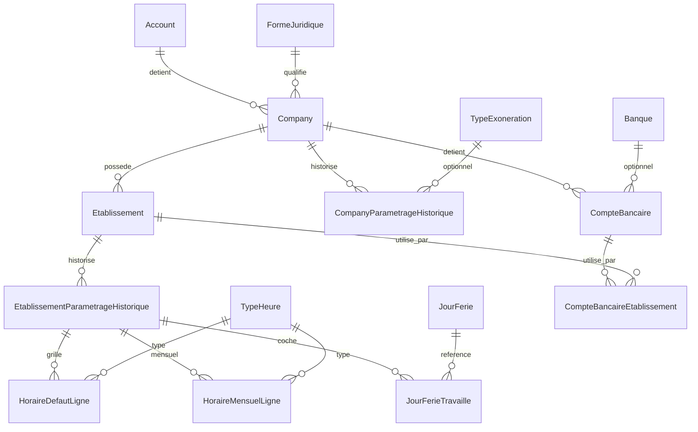

# Modèle de données — Fiche société

- **Module :** 1 — Fiches
- **Étape :** 1.1.a (structure seule, sans API ni écran)
- **Date :** 2026-08-29
- **Source de vérité métier :** `Fiche société v7.xlsx`

---

## 1. Objectif

Ce document décrit le modèle de données de la **fiche société** tel qu’il est posé en base à l’étape 1.1.a. Aucun endpoint ni écran n’existe encore : seules les tables, les relations et les contraintes sont en place.

La fiche société est le point de départ de tout dossier de paie. Elle porte l’identité légale, les établissements, le paramétrage de temps de travail et les comptes bancaires.

---

## 2. Deux niveaux : société et établissement

| Niveau                              | Ce qu’il porte                                                                                                                                                                    |
| ----------------------------------- | --------------------------------------------------------------------------------------------------------------------------------------------------------------------------------- |
| **Société** (`Company`)             | Personne morale : raison sociale, forme juridique, identifiants fiscaux, état du dossier, signataire, matricules, comptes bancaires, paramètres historisés (congés, exonération). |
| **Établissement** (`Etablissement`) | Lieu d’exploitation : adresse, ICE, taxe professionnelle, durée du travail, horaires, jours fériés travaillés, télétravail.                                                       |

Un établissement **principal** est créé avec la société. Exactement un principal existe à tout moment (index unique partiel en base). Les établissements secondaires n’héritent pas de la raison sociale : ces informations restent au niveau société.

---

## 3. Schéma relationnel

---

## 4. Extension de `Company`

Le modèle `Company` du module 0 est **étendu**, pas renommé. Le champ `name` (libellé court des listes de démonstration) coexiste avec `raisonSociale` (nom légal). L’API de lecture du module 0 n’a pas encore été élargie : ce sera l’étape 1.1.b.

### Champs principaux

- Identification : `codeDossier`, `raisonSociale`, `nomCommercial`, `formeJuridiqueId`, `activiteExercee`, identifiants légaux en **String** (zéros de tête préservés).
- Cycle de vie : `etatDossier` (`EN_MONTAGE` / `EN_PRODUCTION` / `INACTIVE`), `moisDebutMontage`, `moisDebutProduction`, `dateInactivite` (format texte `AAAA-MM`).
- Régime : `regimeDeBase` (`NON_AGRICOLE` seulement pour l’instant), `periodicitePaie` (`MENSUEL`).
- Signataire et matricules : civilité / prénom / nom / qualité ; préfixe, longueur (défaut 5), génération auto ; calcul auto des absences entrées/sorties.

### Contraintes d’unicité (par compte)

| Champ                       | Portée                                                |
| --------------------------- | ----------------------------------------------------- |
| `codeDossier`               | Unique par `accountId`                                |
| `identifiantFiscal`         | Unique par `accountId` si renseigné                   |
| `ice` (sur `Etablissement`) | Unique par `accountId`, tous établissements confondus |

Deux comptes différents peuvent porter la même valeur. Les messages d’erreur resteront **neutres** en 1.1.b (étanchéité).

---

## 5. Établissement

Champs : `nom`, `estPrincipal`, adresse complète, `ville`, `pays` (défaut `MA`), `ice`, `taxeProfessionnelle`, téléphone, e-mail.

`accountId` est **dénormalisé** depuis la société : cela permet le filtre multi-tenant et l’unicité de l’ICE sans jointure systématique.

Règles posées (opérations en 1.1.b) :

1. Exactement un `estPrincipal = true` par société.
2. Le principal est créé à la création de la société.
3. Le principal ne se supprime pas tant qu’il est principal (désigner un autre d’abord).

---

## 6. Comptes bancaires

`CompteBancaire` est rattaché à la société. Usages cumulables : salaires, cotisations sociales, IR. État `ACTIF` / `CLOTURE`.

Liaison `CompteBancaireEtablissement` pour le champ « utilisé par ». Les longueurs RIB / IBAN / BIC / ICE **ne sont pas** contraintes en base : avertissement API seulement en 1.1.b.

---

## 7. Tables de référence

Sans `accountId`, maintenues par le `PLATFORM_ADMIN`, lisibles par tous :

- `FormeJuridique` (15)
- `Banque` (21 — `codeBanque` prévu, vide pour l’instant)
- `JourFerie` (18 — code stable, pas de date calendaire)
- `TypeHeure` (4 — sans taux)
- `TypeExoneration` (`TAHFIZ` seulement)

Détail : [03-tables-de-reference.md](./03-tables-de-reference.md).

---

## 8. Historisation

Voir [02-historisation-et-heritage.md](./02-historisation-et-heritage.md). En résumé : tables `CompanyParametrageHistorique` et `EtablissementParametrageHistorique` avec clé `(entité, moisEffet)` au format `AAAA-MM`.

---

## 9. Hors périmètre de cette étape

- Endpoints, DTO, permissions, écrans.
- Salarié, contrat, bulletin, organismes sociaux (CNSS, etc.).
- Calculs (taux, barèmes, SMIG, majorations).
- Auth.js, `payroll-engine/`.
- Suppression physique (champs et contraintes seulement).

---

## 10. Fichiers concernés

| Fichier                                                             | Rôle                                                |
| ------------------------------------------------------------------- | --------------------------------------------------- |
| `apps/api/prisma/schema.prisma`                                     | Modèle                                              |
| `apps/api/prisma/migrations/20260829190000_fiche_societe_module_1/` | Migration                                           |
| `apps/api/prisma/seed.ts` + `reference-data.ts`                     | Références + démo                                   |
| `apps/api/src/modules/companies/*.ts`                               | Utilitaires purs (cohérence, historisation, heures) |
